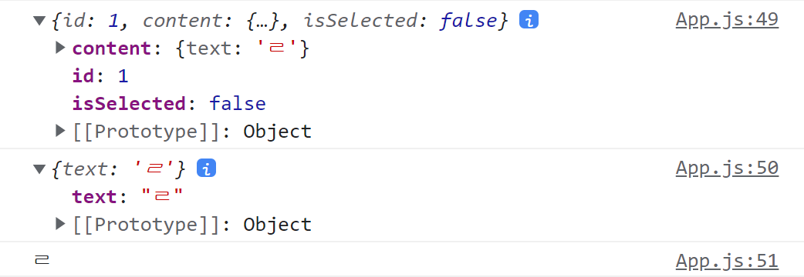

# To-Do-List with React

지난 시간에 만들었던 투두리스트를 리액트로 만들어 보았다.

생활코딩에서 CRUD도 배우고, 인프런에서 강의도 하나 듣고 이해하여서 쉽게 구현할 줄 알았는데 생각대로 되지 않았다.

구글링을 하다가 보니 방식이 너무 제각각이라서 그냥 내가 맘대로 해보고, 가장 유명한 블로그나 영상을 찾아서 수정해가는 방식으로 하려고 한다.

## 겪었던 문제점

### 1. 추가 시 `onClick`함수에 사용자가 입력한 `text`를 보내려 할 때

로컬에 저장되는 `todo`배열은 `App`에서 선언하였고, 추가 시 업데이트 함수 안에서 추가된 배열을 로컬에 갱신하려는 식으로 구현하려 하였다.

하지만,

```js
const Input = ({ updateTodo }) => {
  const [text, setText] = React.useState("");

  function handleSubmit(e) {
    setText(e.target.value);
  }
  return (
    <section className="write__box">
      <input
        type="text"
        className="todo__input"
        placeholder="할 일 추가하기"
        value={text}
        onChange={handleSubmit}
      />
      <button className="btn__add" onClick={() => updateTodo(text)}>
        <i className="fa-solid fa-plus icon__add"></i>
      </button>
    </section>
  );
};

const App = () => {
  // todo 배열
  const [todo, setTodo] = React.useState(() => {
    return jsonLocalStorage.getItem("todolist") || [];
  });

  function updateTodo({ text }) {
    const newTodo = {
      id: todo.length + 1,
      content: { text },
      isSelected: false,
    };
    const currentTodo = [...todo, newTodo];
    setTodo(currentTodo);
    jsonLocalStorage.setItem("todolist", currentTodo);
  }

  return (
    <div className="wrapper">
      <Input updateTodo={updateTodo} />
    </div>
  );
};
```

```js
<button className="btn__add" onClick={updateTodo(text)}>
<button className="btn__add" onClick={updateTodo} text={text}>
```

투두리스트를 작성하는 곳에서 `updateTodo` 함수에 위와 같은 방식으로 시도하였는데

첫 번째 경우는 `updateTodo`가 무한번 호출되는 식으로 되었고,

두 번째 경우는 `text`값이 애초에 넘어가지 않았다.

고민하던 중에, 예전에 이럴 때 화살표 함수로 해결한 적이 있어서 구현해봤는데 해결할 수 있었다.
이 참에 일반적으로 작성하였을 때의 차이를 정확히 알아보자.

**또한 화살표 함수 사용시에 () 와 {}을 어떻게 구분해야 사용하는지도 알아봐야 겠다.**

```js
<button className="btn__add" onClick={() => updateTodo(text)}>
```

### 2. Objects are not valid as a React child

```js
const List = ({ todo }) => {
  return (
    <ul className="todolist">
      {todo.map((todoItem) => (
        <TodoItem todoItem={todoItem.content} />
      ))}
    </ul>
  );
};

const TodoItem = (props) => {
  return (
    <li className="todo__item">
      <div className="checkbox"></div>
      <div className="todotext">{props.todoItem}</div>
      <button className="editBtn">Edit</button>
      <button className="delBtn">X</button>
    </li>
  );
};
```

목표는 List에서 투두리스트의 아이템 하나에 해당하는 `todoItem`를 text로 담아 `props`로 넘기려 할때 발생하는 문제이다.

**즉, 자바스크립트 Object를 리액트 컴포넌트처럼 사용하려 했을 때 생기는 오류이다.**

컴포넌트 끼리 데이터를 주고받을 때 데이터 타입이 다르기 때문에 오류가 발생하였고 단순히 object 자체를 렌더링 하는게 아니라 처리해서 타입을 잡아줘야 한다.

결국 화면에 띄우는건 `String`타입이니까 props로 보내는 데이터 타입도 `Object`가 아니라 `String`으로 보내야 한다는 것이다.

```js
const List = ({ todo }) => {
  console.log(todo[0]);
  console.log(todo[0].content);
  console.log(todo[0].content.text);
  return (
    <ul className="todolist">
      {todo.map((todoItem) => (
        <TodoItem todoItem={todoItem.content.text} key={todoItem.id} />
      ))}
    </ul>
  );
};
```



우선 검증을 위해 출력을 세가지로 해봤다.

첫번째는 그냥 todo 배열의 한 원소, 즉 `Object` 타입이다. 이걸 넘기니까 오류가 난 것이다.

두번째에서 바로 text값이 나와야 하는데 알고보니 또 객체로 이루어져있던 것이다.

기존의 투두리스트의 구조와 다르다는 것을 발견하고 수정해야지 생각했다.

세번째에 와서야 text값을 출력한 모습을 볼 수 있다.

따라서

```js
<TodoItem todoItem={todoItem.content.text} />
```

`text`값 자체를 넘겨서 해결하였다! 단순히 추가를 구현하는 데에만 오류도 최소2~3개 씩 발생하였다..ㅠ

### 3. 고유한 키값

```js
const List = (props) => {
  return (
    <ul className="todolist">
      {props.todo.map((todoItem) => (
        <TodoItem
          text={todoItem.content}
          id={todoItem.id}
          isSelected={todoItem.isSelected}
          deleteTodo={props.deleteTodo}
        />
      ))}
    </ul>
  );
};

const TodoItem = (props) => {
  return (
    <li className="todo__item" key={props.id}>
      <div className="checkbox"></div>
      <div className="todotext">{props.text}</div>
      <button className="editBtn">Edit</button>
      <button className="delBtn" onClick={() => props.deleteTodo(props.id)}>
        X
      </button>
    </li>
  );
};
```

삭제 구현을 구현 하던 중 `map`을 통하여 `list`들을 구성하는데 `li`태그 안에서 `key`값을 설정하였더니 여전히 고유하지 않은 키값이라고 Warning이 떴었다.

```js
<ul className="todolist">
  {props.todo.map((todoItem) => (
    <TodoItem
      key={todoItem.id}
      text={todoItem.content}
      id={todoItem.id}
      isSelected={todoItem.isSelected}
      deleteTodo={props.deleteTodo}
    />
  ))}
</ul>
```

그래서 `ul`태그에서 `map`을 돌릴때 애초에 `key`값을 고유한 `id`값으로 넣어주니 해결할 수 있었다. 이유는 모르겠지만 안에서 하나씩 지정하는건 안되고 만들때 `key`값을 지정해줘야 하는 것 같다.
